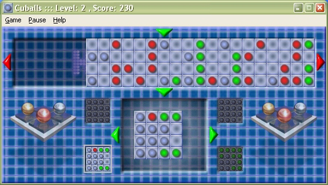



## Cuballs, logic game

### Description

CERTAINLY one of the best logic games ever (at least open-source :) !

The game is based on Microsoft® Finty-Flush, the only difference is that this game is totaly free, and you have the full source code. Have a look at the screenshot.

Now, the objective is to fill all empty grids (four small boxes) with the balls of the same color. You must drop the columns from the upper grid to the lower grid by clicking on the upper table (grid), you can rotate the lower grid by clicking the left or right mouse button. There are five levels, each level adds new color in the game, the last level is almost impossible to complete, so it is great challenge. You must fill out three grids to complete a level, you can manipulate four grids at the same time. For each 4 or 8 seconds new row is added, so when there are 25 rows in the upper grid, guess what - game over.

You can play this game for a long time, without getting bored (which is the most case in logic games), there are many, many, many combinations of colors, many tricks, and you need fast thinking. You can learn here how to make the best brain games, the code is simple and commented. But the game is not only for learning of course, it is VERY interesting, so why to buy it from Microsoft, when you can play it in vb.

And one more thing: VOTE !!!
 
### More Info
 

             |
---                |---
**Submitted On**   |2003-12-31 22:23:36
**By**             |[TheAlas\.com](https://github.com/Planet-Source-Code/PSCIndex/blob/master/ByAuthor/thealas-com.md)
**Level**          |Intermediate
**User Rating**    |5.0 (50 globes from 10 users)
**Compatibility**  |VB 5\.0, VB 6\.0
**Category**       |[Games](https://github.com/Planet-Source-Code/PSCIndex/blob/master/ByCategory/games__1-38.md)
**World**          |[Visual Basic](https://github.com/Planet-Source-Code/PSCIndex/blob/master/ByWorld/visual-basic.md)
**Archive File**   |[Cuballs\_\_l1693401122004\.zip](https://github.com/Planet-Source-Code/thealas-com-cuballs-logic-game__1-50951/archive/master.zip)

### API Declarations

(download the code)

